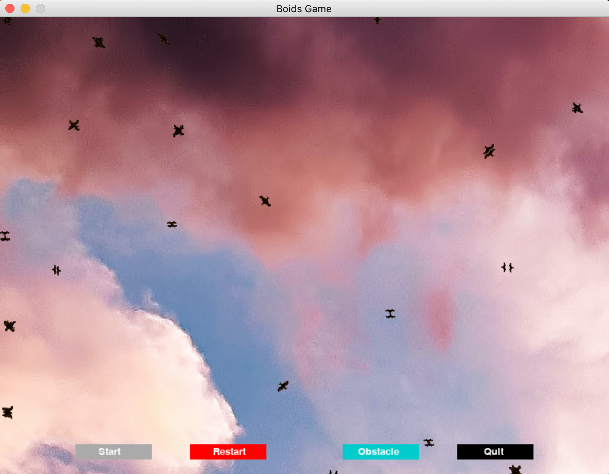

# Boids Game

Boids is an artificial life program, developed by Craig Reynolds in 1986. 
It simulates the flocking behaviour of birds.

Reference:  [Boids](https://en.wikipedia.org/wiki/Boids)

This Boids Game is implemented in python which sumulates the flocking behavior of birds and also the reaction when bumping into obstacles.

# Usage

Open terminal

        python3 Boids.py
        
# Behaviors

## Alignment

## Cohension

## Separation

## Obstacles

